# 基于 FPGA 的可控图像显示系统

## 系统功能简介

​		本系统利用FPGA制作一个使用VGA接口输出可控图像的显示系统。通过串口输入可以显示的矩形区域大小，形成可控图像显示系统。设计并实现按键截图模块，按下按键后将下一帧图像写入SD卡中。

## 系统框架

​		本系统利用FPGA制作一个使用VGA接口输出可控图像的显示系统。视频源为FPGA内部生成的十列十色彩条为背景，50乘50像素的图片在十色等宽彩条的背景上沿着与水平方向呈45°的夹角向右下角运动，当图片边沿触及显示区域边沿时，图片运动方向改变90°，实现图片在屏幕上弹跳的特效。加入串口模块的设计实现上位机通过串口通讯的方式控制视频源，串口传送的标准格式为(x,y,w,h)，x和y表示显示需要显示矩形的左上角顶点坐标，w表示矩形的宽度，h表示矩形的高度。由于开发板资源有限，只使用了640×480@60的分辨率显示输出。因此，串口输入的有效值不得大于屏幕的有效范围。串口发送矩形数据后，只有设定的区域显示图像数据，其他区域显示黑色。通过设计并实现了按键消抖模块，获取按键信号，若按键按下则此时输出的下一帧图像输出存储到SDRAM中，再通过SDRAM输出图像数据存储到SD卡中。其中由于视频数据输出显示时钟速率和SD卡速率不一致，使用异步FIFO作为跨时钟域处理。其整体系统结构如下图所示：

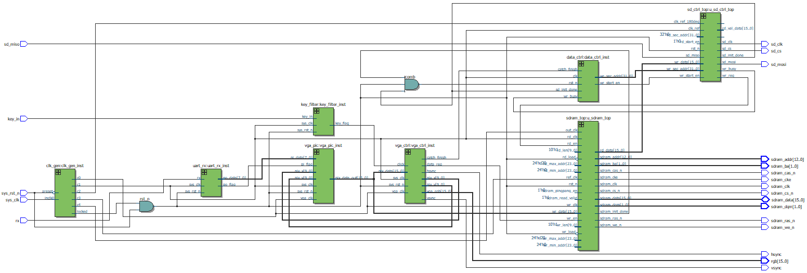

## 硬件介绍

### FPGA

​		本系统使用的时Altea公司的Cyclone IV E系列EP4CE6F17C8 FPGA芯片，其资源情况如下图所示：

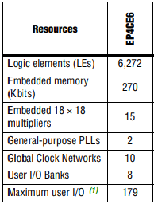

### VGA

​		VGA的中文全称是视频图形阵列，是一种使用模拟信号 进行视频传输的标准协议。其引脚定义如下图所示：

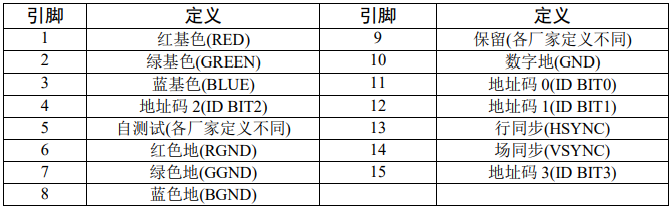

​		VGA 显示器显示图像，并不是直接让图像在显示器上显示出来，而是采用扫描的方 式，将构成图像的像素点，在行同步信号和场同步信号的同步下，按照从上到下、由左到右的顺序扫描到显示屏上。其流程图如下：

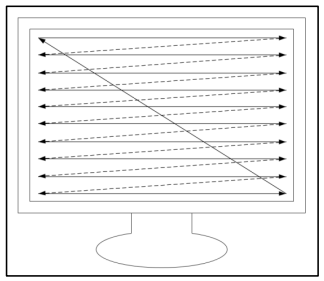

### ROM

​		由于该芯片的ROM存储资源有限，仅有约276,480bits，因此选择50×50像素的图片数据(.mif)写入该芯片的ROM中，用于输出弹跳特效的图片的方块。

### FIFO

​		FIFO 的英文全称是 First In First Out，即先进先出。FPGA 使用的 FIFO 一般指的是对数据的存储具有先进先出特性的一个缓存器，常被用于数据的缓存,或者高速异步数据的交互也即所谓的跨时钟域信号传递。根据 FIFO 工作的时钟域，可以将FIFO分为同步FIFO和异步FIFO。由于截图时SDRAM的写入时钟和图像数据的输出时钟不一致，因此在本项目中需要用到异步FIFO作为跨时钟域的处理。

### SDRAM

​		SDRAM的全称为同步动态随机存储器，其动态的意义为需要不断地刷新来保证存储阵列的数据不丢失。随机指的是数据在SDRAM中的不是按照线性一次存储，而是可以自由地指定地址进行数据的读写。空间存储量大、读写速度快以及价格相对便宜等优点使其在存储界屹立不倒、经久不 衰，广泛应用在计算机中。在本项目中主要使用SDRAM暂存一帧的图像数据，并将其写入SD存储卡中。

### SD存储卡

​		SD 存储卡是一种基于半导体快闪记忆器的新一代记忆设备。它具有体积小、传输速度快、支持热插拔等优点，在便携式装置领域得到了广泛的应用，如数码相机、多媒体播放器、笔记本电脑等。SD 卡共有 9 个引脚线，可以工作在 SDIO 模式或者 SPI 模式。在 SDIO 模式下，共用到 CLK、CMD、 DAT[3:0]六 根 信号线 ； 在 SPI 模 式 下，共用到 CS（SDIO_DAT[3]）、CLK（SDIO_CLK）、MISO （SDIO_DAT[0]）、MOSI（SDIO_CMD）四根信号线。SD 卡接口定义以及各引脚功能说明如下图所示：

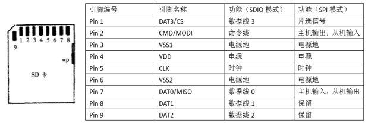

### 串口

​		通用异步收发传输器（Universal Asynchronous Receiver/Transmitter），通常称作UART。UART是一种通用的数据通信协议，也是异步串行通信口（串口）的总称，它在发送数据时将并行数据转换成串行数据来传输，在接收数据时将接收到的串行数据转换成并行数据。本项目利用串口通信来传送上位机需要在显示屏上显示的矩形框大小的数据。

## 软件设计

### 串口接收模块设计

​		串口数据的发送与接收是基于帧结构的，即一帧一帧的发送与接收数据。每一帧除 了中间包含 8bit 有效数据外，还在每一帧的开头都必须有一个起始位，且固定为 0；在每 一帧的结束时也必须有一个停止位，且固定为1，即最基本的帧结构（不包括校验等）有 10bit。在不发送或者不接收数据的情况下，rx 和 tx 处于空闲状态，此时 rx 和 tx 线都保持 高电平，如果有数据帧传输时，首先会有一个起始位，然后是 8bit 的数据位，接着有1bit的停止位，然后 rx 和 tx 继续进入空闲状态，然后等待下一次的数据传输。如图所示 为一个最基本的串口帧结构。rx 一位一位地接收，从最低位到最高位依次接收，最后在模块内位拼接成比特数据。

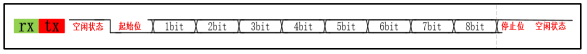

​		对串口模块进行传送数据仿真，对于控制矩形大小的(x,y,w,h)数据使用16bit来传输，传送4个0x0064数据仿真如下图所示：

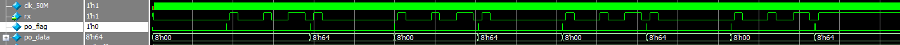

​		可以看出串口成功传送了四个16bit的数据，接收模块也成功接收并写入了控制模块中，用于控制VGA的输出数据只在串口设定的矩形框内。

### VGA输出显示模块设计

​		VGA输出显示模块主要有两部分组成，一部分是像素点RGB信号产生模块即视频源，另外一部分是VGA的时序控制模块。

#### 时序模块

​		VGA输出的行场同步时序有严格要求，时序的不正确会导致图像输出失败，本项目中使用的是640×480@60的显示模式，其时序要求如下图所示：

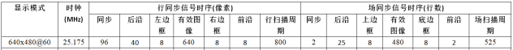

#### 场同步

​		通过对VGA输出信号进行仿真观察，每一个场同步信号对应输出一帧画面，仿真图如下所示：

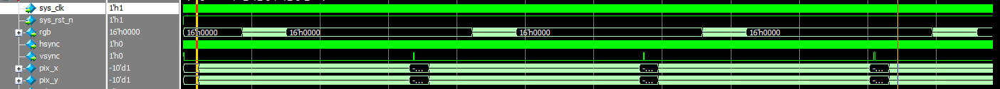

​		可以看出每一个场同步信号对应的数据为扫描整个屏幕输出的像素信息，由于之前在串口模块部分已经发送了只在100×100的矩形上显示的要求，因此在矩形之外应该显示黑色，所以除了集中一段有颜色数据，另外一部分是0x0000。

#### 行同步

​		通过对VGA输出信号进行仿真观察，每一个行同步信号对应输出一行画面，仿真图如下所示：

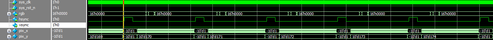

​		从仿真图中可以看出，行同步信号内的像素信息时序满足同步，后沿，左边框，有效图像，有边框，前沿等要求。

#### 可控矩形显示测试

​		通过对从串口处接收的矩形大小数据来控制显示屏幕的可显示区域，可以看出pix_y的数据的差值刚好是100整，同时验证pix_x的差值100整。即模块成功获取了串口的数据并实现了对屏幕显示的可控制。

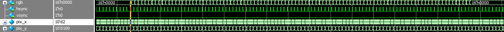

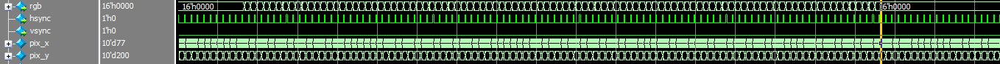

### 按键消抖模块设计

​		按键的作用主要是当使用者按下按键之后将此时显示的下一帧图像数据写入到SD卡中。通过设计按键消抖模块对机械按键的按键抖动进行消除，避免让VGA控制模块误读多次，造成重复截图。其仿真如下图所示：

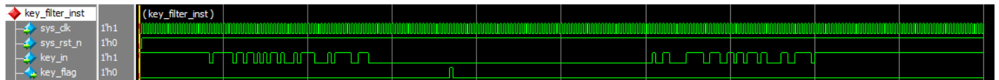

​		同时，为了保证在SD存储卡为初始化完成时，不能够通过按键触发，仿真测试如下图所示：

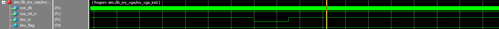

​		可以看到，在SD存储卡未完成初始化时，当按键按下后(key_in)被拉低，没有触发按键模块(key_flag)。

### SD存储卡写入模块设计

​		SD存储卡初始化模块完成对SD存储卡的上电初始化操作，其基本步骤状态机如下图所示：

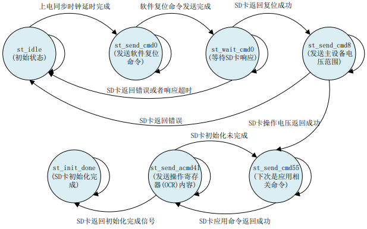

​		基于状态机的命令代码编写如下：

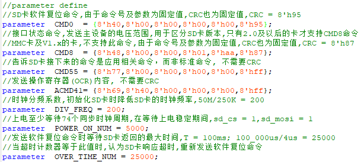

​		对状态机的输出进行仿真结果如下：

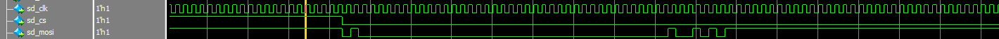

​		通过上述仿真波形可以看出指令与CMD0  = {8'h40,8'h00,8'h00,8'h00,8'h00,8'h95}相一致，说明指令发送正确。由于在仿真过程中无法将SD存储卡返回的信息获取，因此省略后续步骤的仿真。

### SDRAM模块设计

​		在学习SDRAM的读写时序后，我们知道SDRAM的读写速率在100MHz时钟频率下，而图像数据输出时钟速率为25MHz，SD存储卡的写入速率为50MHz，由于图像数据写入SDRAM的时钟速率和SDRAM数据写入SD卡的时钟速率不一致，出现了跨域的问题。因此需要编写读写FIFO来控制跨时钟域的问题。同时需要编写SDRAM 控制器负责完成外部 SDRAM 存储芯片的初始化、读写及刷新等一系列操作。其基本流程如下图所示：

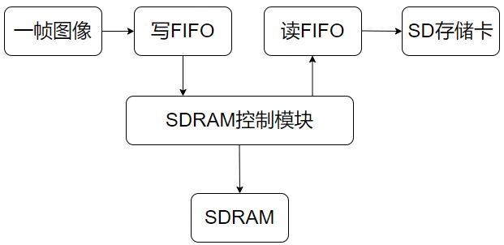

​		对SDRAM的写入时序进行仿真，可以看出在按下按键时并不是马上将此时的图像数据写入SDRAM中，而是等待一个场同步之后再将下一帧的图像数据写入到SDRAM内，这样就能够保证每次截图的是一帧完整的图像，而不会造成残缺的现象。同时，在传输完一帧图像后将不再使能SDRAM的写入，避免截取多帧图像。

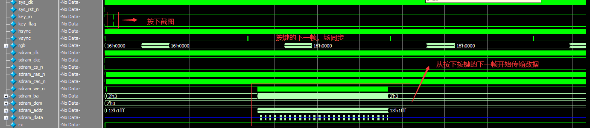

## 总结

​		在经过学习了VGA输出时序和SDRAM和SD存储卡的时序后，更感到FPGA数字电路设计的博大精深，很遗憾由于开发板资源有限而且没有640×480像素的屏幕，无法进行上板验证，但是我依然能够体会到设计调试的艰难和设计成功的喜悦。最后，本系统设计的详细模块如图所示：

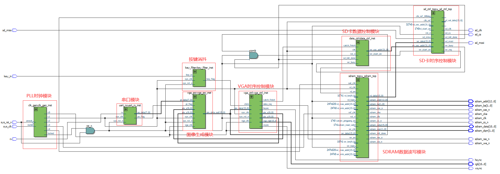

​		开发板资源使用率：

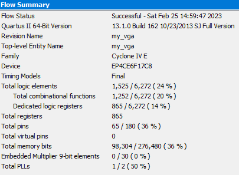

​		开发板样图：

